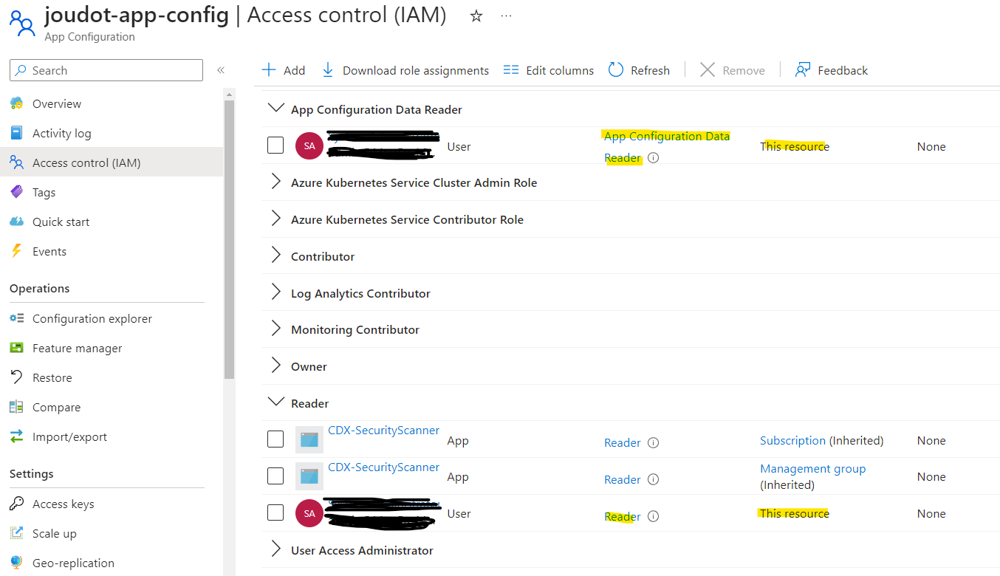
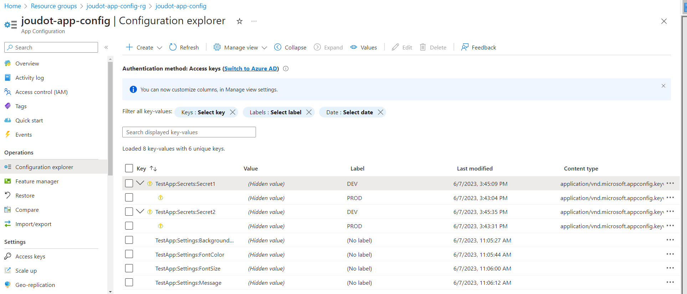
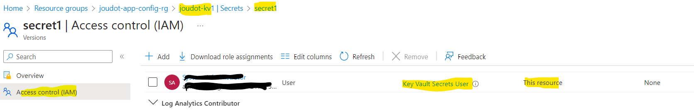
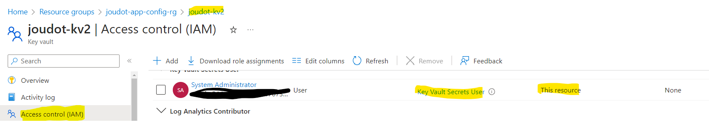
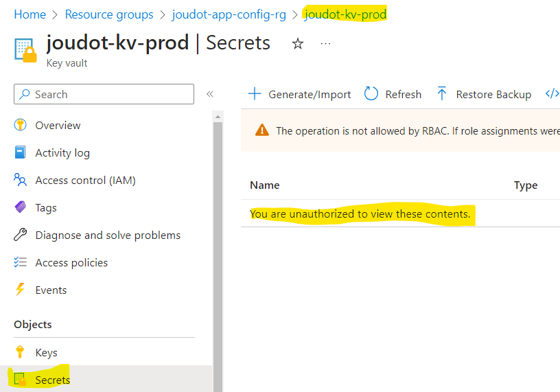
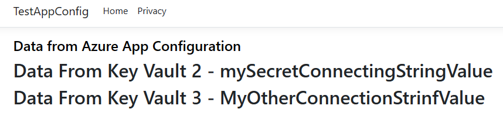
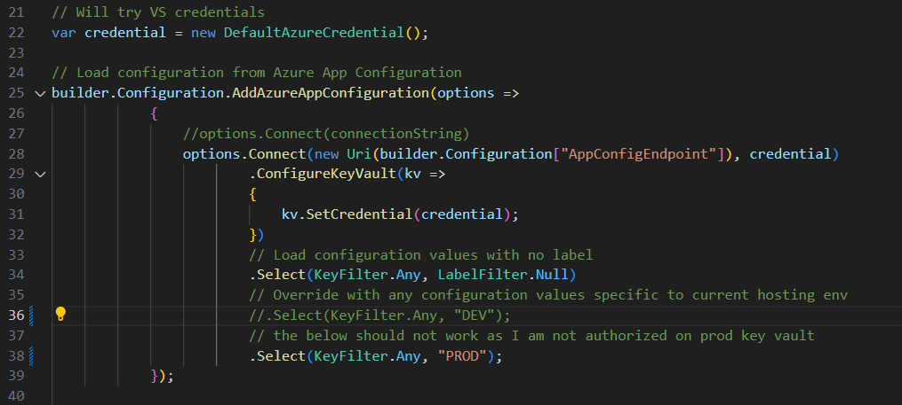
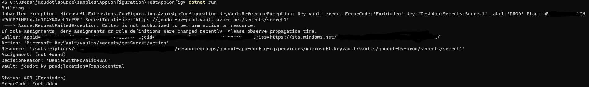

# Introduction
The intend of this repository is to test a few features offered by Azure App Configuration Service:
- Integrate App Configuration as a configuration provider in a .NET 6 Application
- Use different Key Vault references to store secrets
- Use labels to differentiate secrets for DEV and PROD and demonstrate how different levels of access can be configured to prevent developers from seeing production secrets
  
# Sources
To create this sample, I followed the instructions here: https://learn.microsoft.com/en-us/azure/azure-app-configuration/quickstart-aspnet-core-app?tabs=core6x

Instead of using the read only key as a connection string, I used DefaultAzureCredential and added myself as a reader to be authorized to access both the App Config environment and read the configuration.



Created two key Vaults with RBAC policies and my account as Admin to create two secrets.

Followed App Config <-> Key Vault doc to integrate/initialize the Key Vault authentication here https://learn.microsoft.com/en-us/azure/azure-app-configuration/use-key-vault-references-dotnet-core?tabs=core5x#update-your-code-to-use-a-key-vault-reference

Used DEV and PROD labels for secrets configurations pointing to different key vaults (for PROD vs for DEV): https://learn.microsoft.com/en-us/azure/azure-app-configuration/howto-labels-aspnet-core?tabs=core5x


# Prerequisites

To use this sample, the first step is to deploy the supporting infrastructure. It can be done using the Bicep file in the **Infra** folder. 

```
az deployment group create --resource-group $(resourceGroupName) --template-file Infra\main.bicep
```

Then the below list of configurations/secrets can be used for testing:



The two DEV secrets point to Key Vault 1 and Key Vault 2 while both PROD secrets point to Key Vault Prod

I have access to the secrets 1 only in Key Vault 1 (need access at the key vault level to see the secret in the secrets list but having the authorization at the secret level only is enough to read the secret from the sample App)



I have access to all secrets in the key vault 2.



In Production I have no access



# Demonstration

From the **TestAppConfig** folder, run 

```
dotnet build

dotnet run
```

Then, you should see you have access to the connection string values.



In **Program.cs** comment the filter on DEV label and uncomment the PROD filter. 



Build and run again and you should see an error as you don't have access to the production key vault. 


